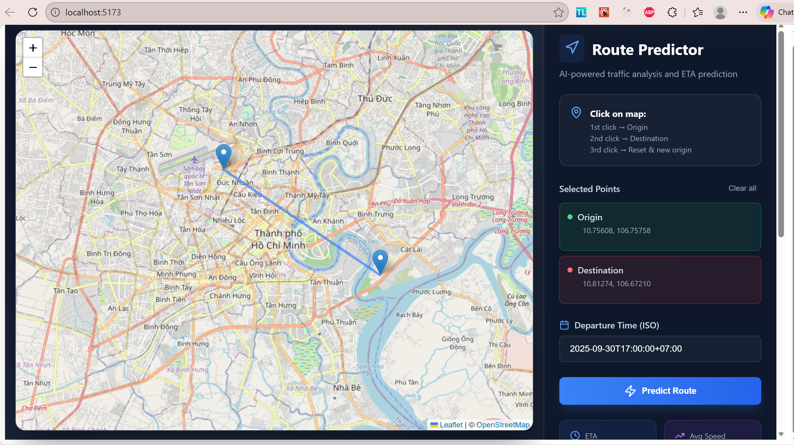
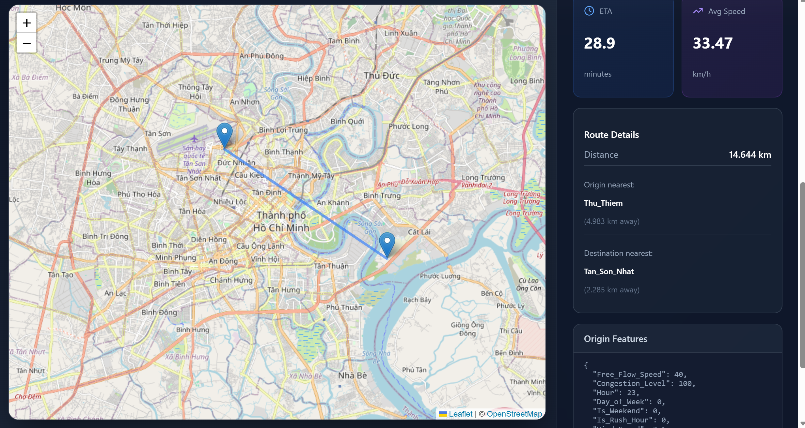

# 🚦 Traffic Speed & ETA Prediction System
### Ho Chi Minh City Traffic Intelligence

An end-to-end machine learning system for predicting traffic speeds and route ETAs in Ho Chi Minh City. This project combines real-world traffic data, weather conditions, and temporal patterns to deliver accurate predictions through an interactive web application.

---

## 📌 Overview

Ho Chi Minh City presents unique traffic challenges that make prediction particularly complex:

- 🏍️ **Motorbike-dominated traffic** — Over 80% of vehicles are motorcycles
- 🛣️ **Aging infrastructure** — Narrow roads and limited expansion capacity
- ⏰ **Severe rush hours** — Morning (7-9 AM) and evening (5-7 PM) congestion
- 🌧️ **Weather impact** — Tropical climate with frequent rainfall affecting traffic flow

This system models these characteristics using machine learning regression to provide realistic, context-aware traffic predictions.

---

## ✨ Key Features

| Feature | Description |
|---------|-------------|
| 🗺️ **Interactive Map** | Click-based origin and destination selection with real-time visualization |
| ⏱️ **ETA Prediction** | Accurate arrival time estimates based on current conditions |
| 📊 **Speed Analysis** | Average speed calculation considering congestion and weather |
| 🌦️ **Weather Integration** | Real-time weather data impact on traffic patterns |
| 🤖 **ML-Powered** | KNN Regressor optimized for HCMC traffic characteristics |
| 🔌 **REST API** | FastAPI backend for seamless integration |
| 💻 **Modern UI** | React + Leaflet for responsive, intuitive user experience |

---

## 🗂️ Project Structure

```
project-root/
├── 📁 data/                          # Raw and processed datasets
│   └── traffic_weather_data.csv      # Combined traffic & weather data
│
├── 📁 website/
│   ├── 📁 frontend/                  # React + Leaflet UI
│   │   ├── src/
│   │   ├── public/
│   │   └── package.json
│   │
│   └── 📁 server/                    # FastAPI + ML inference
│       ├── 📁 model/                 # Trained model artifacts
│       │   ├── knn_model.joblib
│       │   ├── scaler.joblib
│       │   └── feature_names.joblib
│       └── main.py                   # API server
│
├── 📓 data_collection.ipynb          # Data gathering & preprocessing
├── 📓 data_visualization.ipynb       # Exploratory data analysis
├── 📓 machine_learning.ipynb         # Model training & evaluation
│
└── 📄 README.md
```

---

## 🚀 Getting Started

#### 1️⃣ Backend Setup

```bash
# Navigate to server directory
cd website/server

# Start the FastAPI server
uvicorn main:app --reload --port 8001
```

The API will be available at `http://localhost:8001`

#### 2️⃣ Frontend Setup

```bash
# Navigate to frontend directory
cd website/frontend

# Install dependencies
npm install

# Start development server
npm run dev
```

The application will open at `http://localhost:3000`




---

## 🔌 API Documentation

### Endpoint: `POST /predict_route`

**Request Body:**
```json
{
  "origin": {
    "lat": 10.7769,
    "lng": 106.7009
  },
  "destination": {
    "lat": 10.8231,
    "lng": 106.6297
  },
  "iso_datetime": "2025-09-30T17:00:00+07:00"
}
```

**Response:**
```json
{
  "origin": {
    "nearest_location": {
      "name": "District 1",
      "distance_km": 0.5
    }
  },
  "destination": {
    "nearest_location": {
      "name": "Tan Binh District",
      "distance_km": 0.3
    }
  },
  "distances": {
    "route_km": 12.5
  },
  "speeds": {
    "average_kmh": 35.2
  },
  "eta_minutes": 21.3,
  "features_used": {
    "origin": {...},
    "destination": {...}
  }
}
```

---

## 📊 Data & Machine Learning

### Feature Engineering

The model uses a comprehensive set of features to capture traffic dynamics:

| Category | Features |
|----------|----------|
| **Traffic** | Free Flow Speed, Congestion Level |
| **Temporal** | Hour, Day of Week, Is Weekend, Is Rush Hour |
| **Weather** | Temperature, Humidity, Rainfall, Wind Speed |

### Model Selection

Multiple regression models were evaluated:

| Model | Performance | Notes |
|-------|-------------|-------|
| Linear Regression | Baseline | Simple but limited for non-linear patterns |
| Ridge Regression | Good | L2 regularization helps with overfitting |
| Decision Tree | Moderate | Prone to overfitting |
| **KNN Regressor** | ✅ **Best** | Excellent for local pattern capture |
| SVR (RBF) | Good | Computationally expensive |

### Model Performance

```
Training R² Score: 0.87
Test R² Score: 0.84
Mean Absolute Error: 3.2 km/h
Root Mean Squared Error: 4.8 km/h
```


## 📈 Key Insights

### Traffic Patterns Discovered

1. **Congestion Level** is the strongest predictor (correlation: 0.82)
2. **Rush hour periods** show 45% speed reduction on average
3. **Rainfall** reduces average speed by 15-20%
4. **Weekend traffic** is 30% lighter than weekdays
5. **Free-flow speed** varies significantly by district (15-60 km/h)

### Model Interpretability

The system provides full transparency:
- All input features are visible to users
- Feature importance rankings available
- Clear explanation of prediction factors

---


<div align="center">

Individual Project – Year 2, Semester 3
AI & Machine Learning, Data

</div>